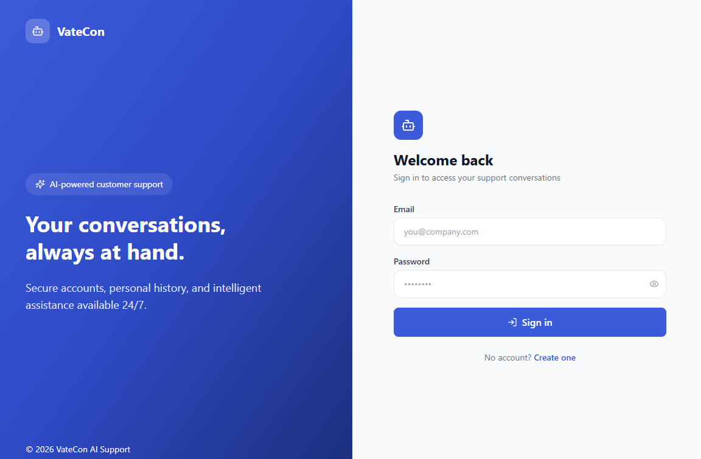
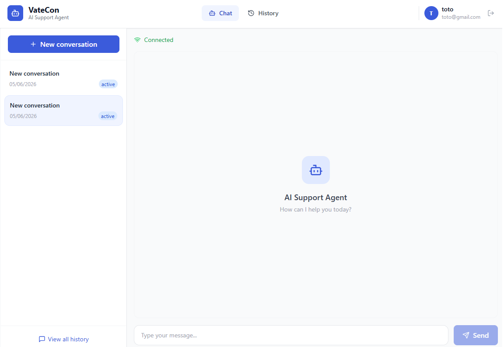
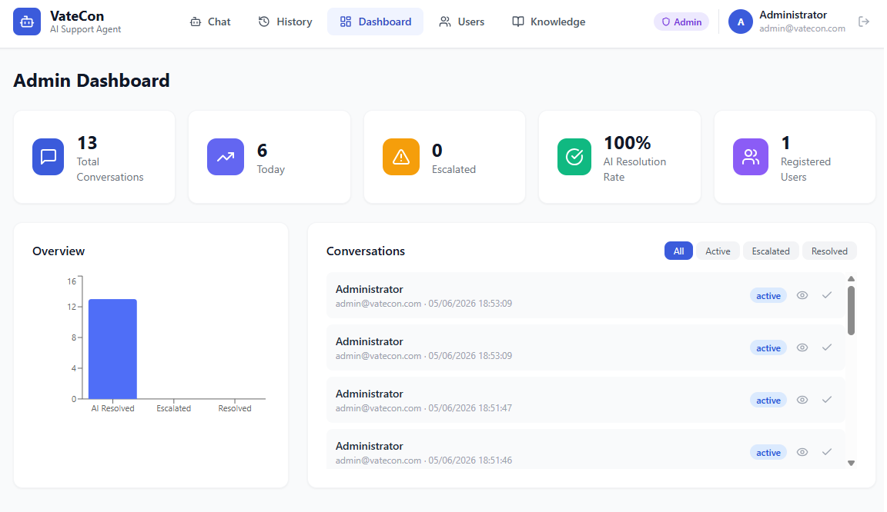
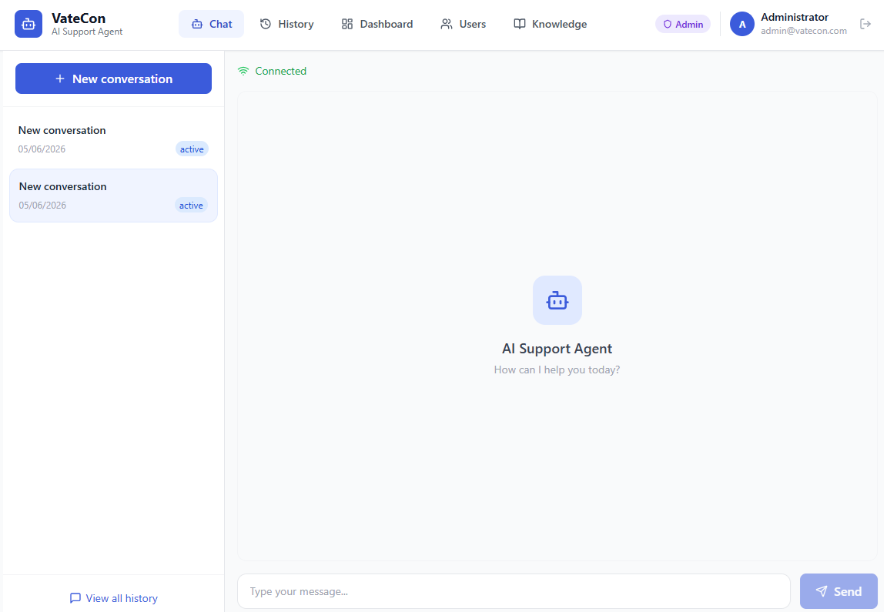
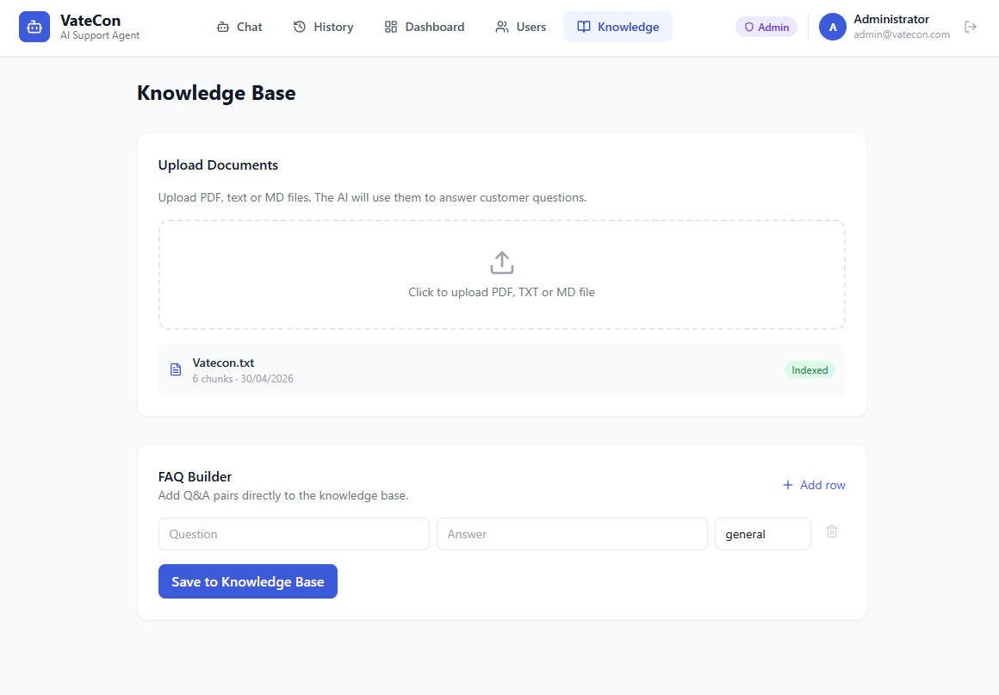

# VateCon — AI Support Agent

> AI-powered customer support automation system.

---

## Getting Started

### 1. Launch the application

**Prerequisites:** [Docker Desktop](https://www.docker.com/products/docker-desktop/) and an OpenAI API key.

```bash
cp .env.example .env
# Set OPENAI_API_KEY in .env, then:
docker compose up --build
```

First launch takes approximately 3–5 minutes (image download and dependency installation).

### 2. Sign in

Open **http://localhost:3000** in your browser. Unauthenticated sessions are redirected to the login page.



**Administrator account** (created automatically on first startup):

| Field | Value |
|-------|-------|
| Email | `admin@vatecon.com` |
| Password | `Admin123!` |

**User account:** self-service registration at http://localhost:3000/register (minimum 8 characters).

### 3. Application URLs

| Interface | URL |
|-----------|-----|
| Login | http://localhost:3000/login |
| Register | http://localhost:3000/register |
| Chat | http://localhost:3000 |
| History | http://localhost:3000/history |
| Admin dashboard | http://localhost:3000/admin |
| User management | http://localhost:3000/admin/users |
| Knowledge Base | http://localhost:3000/knowledge |
| API documentation | http://localhost:8000/docs |

> **Security note:** keep `COOKIE_SECURE=false` for local HTTP. In production behind HTTPS, set `COOKIE_SECURE=true` in `.env`.

---

## Overview

VateCon AI Support Agent is a complete solution that enables a company to automate 70–80% of its customer support tickets using AI. The agent responds in real time, cites its sources, indicates its confidence score, and automatically escalates complex cases to a human.

**Tech stack:**
- **Backend:** FastAPI + LangChain + OpenAI GPT-4o + FAISS (RAG) + PostgreSQL
- **Frontend:** React + TypeScript + Tailwind CSS + WebSocket
- **Infrastructure:** Docker Compose (4 orchestrated services)

---

## Features

### Authentication

- Open registration for users
- JWT access token (15 min) + httpOnly refresh cookie
- Each user sees **only their conversations**
- Admin sees **everything** and manages the Knowledge Base

### Chat interface (`/`)



- Real-time WebSocket connection (JWT required)
- Sidebar with recent conversations
- Typing indicator while the AI generates a response
- Display of **confidence score** on each response (0–100%)
- Cited sources (name of the document used to answer)
- Escalation banner visible when the conversation is transferred to a human

### Admin dashboard (`/admin`)



- Global statistics: number of conversations, AI resolution rate, escalations, today’s conversations
- Distribution chart (resolved by AI / escalated / closed)
- Conversation list with filters by status (active, escalated, resolved)
- Full message view of a conversation
- Manual close button for a conversation

### User management (`/admin/users`)



- List of all registered accounts
- Conversation count per user
- Enable / disable accounts

### Knowledge Base (`/knowledge`)



**Document upload**
Drop a PDF or TXT file. The system automatically splits it into chunks, generates embeddings via OpenAI, and indexes them in FAISS. The agent then uses this information to answer clients.

**FAQ Builder**
Directly add Question/Answer pairs without a file. Ideal for standard answers (pricing, refund policy, hours, etc.).

### Automatic escalation

The agent automatically escalates a conversation in two cases:
1. **Confidence score < 50%** — the answer is not reliable enough
2. **Sensitive keyword detected** — refund, fraud, talk to a human, etc.

---

```bash
# Prerequisites for test notebooks
pip install requests websocket-client colorama
```

---

## Sales pitch

| Problem | Solution |
|---------|----------|
| A support team answers the same questions 50x a day | The AI agent answers 70–80% of tickets automatically |
| Training a chatbot takes months | Just drop your docs — up and running in minutes |
| Incorrect answers hurt reputation | Confidence score + automatic escalation to a human |
| No visibility on support | Real-time dashboard with all conversations |

**Typical ROI for an SME:** 5 to 15 hours saved per week on customer support.

---

## Environment variables

| Variable | Description | Default |
|----------|-------------|---------|
| `OPENAI_API_KEY` | OpenAI API key | — |
| `OPENAI_MODEL` | Model used | `gpt-4o` |
| `POSTGRES_USER` | PostgreSQL user | `vatecon` |
| `POSTGRES_PASSWORD` | PostgreSQL password | `vatecon_secret` |
| `POSTGRES_DB` | Database name | `vatecon_db` |
| `SECRET_KEY` | JWT secret key | — |
| `ADMIN_EMAIL` | Initial admin email | `admin@vatecon.com` |
| `ADMIN_PASSWORD` | Initial admin password | `Admin123!` |
| `ACCESS_TOKEN_EXPIRE_MINUTES` | Access token lifetime | `15` |
| `REFRESH_TOKEN_EXPIRE_DAYS` | Refresh token lifetime | `7` |
| `COOKIE_SECURE` | HTTPS-only refresh cookie | `false` |
| `ALLOWED_ORIGINS` | Allowed CORS origins | `http://localhost:3000` |

---

## Architecture

```
┌─────────────────────────────────────────────────────┐
│                   Client (React)                    │
│   /login      → Login                               │
│   /register   → Register                            │
│   /           → Real-time chat + history            │
│   /history    → All my conversations                │
│   /admin      → Admin dashboard (admin only)        │
│   /admin/users→ User management (admin only)        │
│   /knowledge  → Document upload + FAQ (admin only)  │
└────────────────────────┬────────────────────────────┘
                         │ HTTP + WebSocket (Nginx proxy)
┌────────────────────────▼────────────────────────────┐
│                 Backend (FastAPI)                   │
│                                                     │
│  WebSocket /ws/chat/{session_id}                    │
│       ↓                                             │
│  SupportAgent (LangChain)                           │
│       ↓                                             │
│  FAISS (vectorstore RAG)  ←  docs / FAQ             │
│       ↓                                             │
│  GPT-4o → response + confidence score               │
│       ↓                                             │
│  PostgreSQL (users + conversation history)          │
└─────────────────────────────────────────────────────┘
```

---
